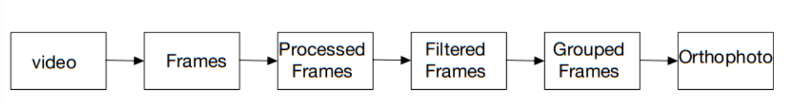

## Algorithm Explanation

* Extract frames from video
* Process frames in order to increase quality with:
  * Sharpness using kernel.
  * Reducing noise using gaussian.
  * Adjusting lightning using CLAHE - Contrast Limited Adaptive Histogram Equalization.
* Filter frames according to the following characteristics:
  * blur (using Laplacian)
* Group frames based on image overlap.	
* Generate orthophotos using ODM.

## Next Steps

* Investigate the effect of camera parameters (e.g., movement speed, angle) on frame selection and quality.
* Explore surface characteristics (e.g., size) and how they impact the orthophoto creation.
* Investigate about the default parameters, and check if they need to be changed.
* Read more about the frames selecting features and improve the filtering and processing frame steps to get a more accurate result.
* Add logging for better debugging.
* Implement multiprocessing to reduce computation time.
* Improve user interface:
* Allow resize the window
* Explore about colors and formats that improves user experience
* Add buttons for ODM control, threshold adjustments, and choosing similarity method.
* Test the program with more videos 
